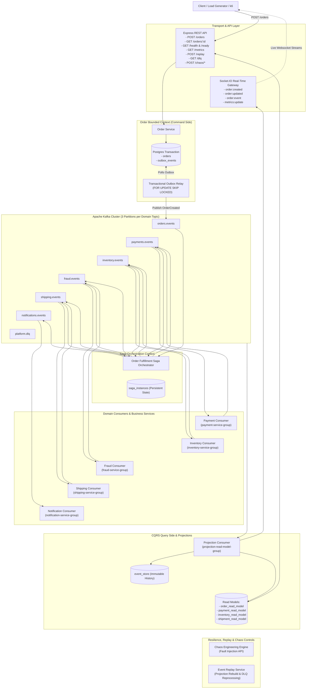
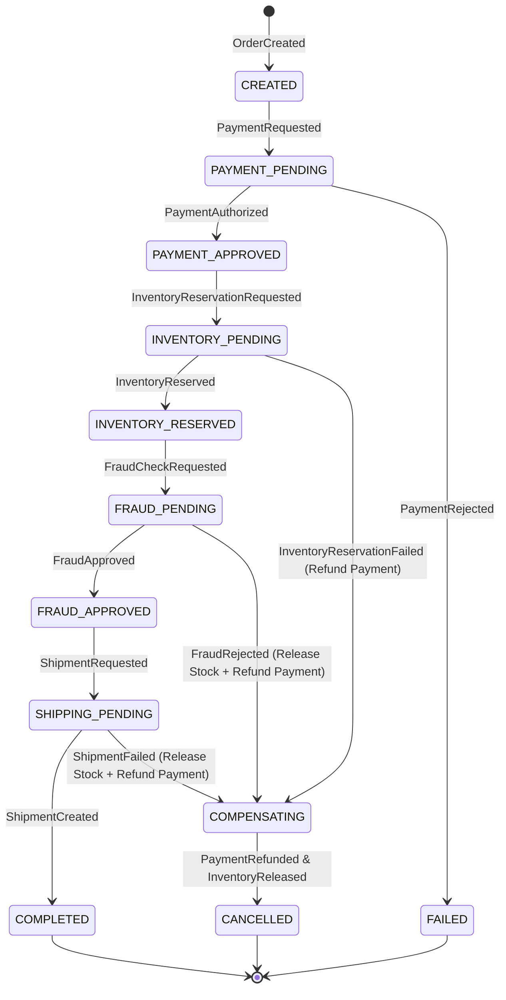

# Event-Driven Kafka Fulfillment Platform

[](https://www.typescriptlang.org/)
[](https://kafka.apache.org/)
[](https://www.postgresql.org/)
[](https://www.docker.com/)
[](https://opensource.org/licenses/MIT)

A production-grade **Event-Driven Architecture (EDA)** reference implementation and laboratory built with **Node.js, TypeScript, Apache Kafka, PostgreSQL, and Socket.IO**.

This repository demonstrates how to architect, operate, test, and observe resilient distributed systems using foundational design patterns: **Transactional Outbox, Orchestrated Sagas, Compensating Transactions, Idempotent Consumers, Dead Letter Queues, CQRS Projections, Event Replay, and Chaos Engineering**.

---

## 1. System Architecture



---

## 2. Core Distributed Systems Patterns Implemented

### 2.1 Transactional Outbox Pattern
Eliminates dual-write anomalies. When `POST /orders` executes, the Order write-model and the `OrderCreated` domain event are committed **atomically** in a single PostgreSQL database transaction. An asynchronous `OutboxRelay` background worker polls pending records using `FOR UPDATE SKIP LOCKED` and publishes them to Kafka with strict ordering.

### 2.2 Orchestrated Saga & Automated Compensations
Coordinates distributed transactions across 5 bounded contexts. If inventory is out of stock or fraud risk score is excessive, the `SagaOrchestrator` transitions to `COMPENSATING` and dispatches rollback actions (`PaymentRefundRequested` and `InventoryReleased`) before safely reaching the `CANCELLED` terminal state.



### 2.3 Scoped Idempotent Consumers
Protects against at-least-once message duplication caused by Kafka partition rebalances or consumer crashes. Every consumer tracks processed events in `processed_events` with `UNIQUE (event_id, consumer_name)`.

### 2.4 Retry Backoff & Dead Letter Queue (DLQ)
Retries transient failures with exponential backoff and randomized jitter:
$$\text{Delay} = \min(10000, 500 \times 2^{\text{attempt} - 1}) + \text{random}(0, 200)$$
Permanent or poison-pill failures route to `platform.dlq` and the `dlq_messages` table for operator inspection and replay.

### 2.5 CQRS & Event Sourcing History
Separates write-side transactional persistence from read-side materialized views (`order_read_model`, `payment_read_model`, `shipment_read_model`). All historical events are stored in the append-only `event_store` table.

### 2.6 Event Replay Engine
Enables instant reconstruction of corrupted read models or re-submission of dead-letter messages via `POST /replay` and `POST /dlq/:id/replay`.

### 2.7 Controlled Chaos Engineering
Allows testing distributed resilience in real-time via REST endpoints (`/chaos/payment/failure`, `/chaos/inventory/failure`, `/chaos/fraud/rejection`, `/chaos/fraud/latency`, `/chaos/shipping/failure`). Disabled by default.

---

## 3. Standardized Event Envelope

Every event produced in the system adheres to the universal envelope schema:

```json
{
  "event_id": "evt_d3b07384-d113-469b-9c69-238bd7584310",
  "event_type": "OrderCreated",
  "event_version": 1,
  "aggregate_id": "ord_8f1b2c3d",
  "aggregate_type": "Order",
  "occurred_at": "2026-09-21T02:00:00.000Z",
  "producer": "order-service",
  "correlation_id": "corr_8f1b2c3d",
  "causation_id": "cmd_8f1b2c3d",
  "schema_version": 1,
  "payload": {
    "order_id": "ord_8f1b2c3d",
    "user_id": "usr_48102",
    "items": [
      { "sku": "LAPTOP-001", "name": "Workstation", "price": 1999.99, "quantity": 1 }
    ],
    "total_amount": 1999.99,
    "currency": "USD"
  }
}
```

---

## 4. Getting Started

### 4.1 Prerequisites
* Node.js >= 20.0.0
* Docker & Docker Compose

### 4.2 Start the Stack (Calibrated with Host Memory Watchdog)
```bash
# Starts ZooKeeper, Kafka, PostgreSQL, and API with dynamically calibrated memory limits
./scripts/start.sh
```

### 4.3 Native Development & Tests
```bash
# Install dependencies
npm install

# Compile TypeScript
npm run build

# Run all test suites
npm test

# Run unit tests only
npm run test:unit

# Run HTTP integration tests
npm run test:integration

# Run E2E pipeline tests
npm run test:e2e
```

---

## 5. REST API Reference

| Method | Endpoint | Description |
| :--- | :--- | :--- |
| `POST` | `/orders` | Accepts a new order (Returns `202 Accepted` + `order_id`) |
| `GET` | `/orders` | Lists recent orders from CQRS read model |
| `GET` | `/orders/:id` | Returns order details, line items, and event timeline |
| `GET` | `/orders/:id/events` | Returns full event history from `event_store` |
| `GET` | `/health` | Liveness probe (Process & Database health) |
| `GET` | `/ready` | Readiness probe (Kafka & PostgreSQL connectivity) |
| `GET` | `/consumers` | Live health and throughput metrics for all Kafka consumers |
| `GET` | `/metrics` | Aggregated operational metrics (active sagas, orders/sec, DLQ) |
| `GET` | `/sagas` | Lists recent saga instances and current state machine steps |
| `GET` | `/sagas/:id` | Detailed view of a specific saga execution graph |
| `GET` | `/dlq` | Lists unresolved dead-letter queue messages |
| `POST` | `/dlq/:id/replay` | Replays a dead-letter message back to Kafka |
| `POST` | `/replay` | Replays events for an aggregate to rebuild read models |
| `GET` | `/chaos/status` | Current chaos simulation configuration |
| `POST` | `/chaos/payment/failure` | Toggles payment authorization decline |
| `POST` | `/chaos/inventory/failure`| Toggles inventory out-of-stock failure |
| `POST` | `/chaos/fraud/rejection` | Toggles fraud detection rejection |
| `POST` | `/chaos/reset` | Resets all chaos settings to disabled |

---

## 6. Load Benchmark & Performance Testing

The platform includes a built-in load generator benchmark:

```bash
# Benchmark local ingestion throughput
npm run load-test
```

---

## 7. Architecture Documentation Index

* [`docs/00_ARCHITECTURE_AUDIT.md`](./docs/00_ARCHITECTURE_AUDIT.md) — Baseline repository audit and technical debt assessment.
* [`docs/01_ARCHITECTURE.md`](./docs/01_ARCHITECTURE.md) — High-level system architecture and event choreography.
* [`docs/02_KAFKA_TOPIC_CATALOG.md`](./docs/02_KAFKA_TOPIC_CATALOG.md) — Complete topic taxonomy, retention, and partition strategy.
* [`docs/03_EVENT_CONTRACTS.md`](./docs/03_EVENT_CONTRACTS.md) — Universal envelope and domain event schemas.
* [`docs/04_TRANSACTIONAL_OUTBOX.md`](./docs/04_TRANSACTIONAL_OUTBOX.md) — Outbox table design and relay engine.
* [`docs/05_IDEMPOTENCY.md`](./docs/05_IDEMPOTENCY.md) — Consumer deduplication and at-least-once safety.
* [`docs/06_SAGA.md`](./docs/06_SAGA.md) — Orchestrated saga state machine and compensation flows.
* [`docs/07_PARTITIONING.md`](./docs/07_PARTITIONING.md) — Partition key hashing and message ordering.
* [`docs/08_SCHEMA_EVOLUTION.md`](./docs/08_SCHEMA_EVOLUTION.md) — Versioning and compatibility rules.
* [`docs/09_RETRY_DLQ.md`](./docs/09_RETRY_DLQ.md) — Exponential backoff retry and Dead Letter Queue management.
* [`docs/10_CQRS.md`](./docs/10_CQRS.md) — Command-query separation and materialized read models.
* [`docs/11_EVENT_REPLAY.md`](./docs/11_EVENT_REPLAY.md) — State reconstruction and DLQ re-publishing engine.
* [`docs/12_OBSERVABILITY.md`](./docs/12_OBSERVABILITY.md) — Structured JSON logging and distributed tracing.
* [`docs/13_CHAOS_ENGINEERING.md`](./docs/13_CHAOS_ENGINEERING.md) — Controlled fault simulation engine.
* [`docs/14_FAILURE_SCENARIOS.md`](./docs/14_FAILURE_SCENARIOS.md) — Failure recovery verification guide.
* [`docs/15_TESTING.md`](./docs/15_TESTING.md) — Testing pyramid and test execution.
* [`docs/16_LOAD_TESTING.md`](./docs/16_LOAD_TESTING.md) — k6 and benchmark test guide.
* [`docs/17_LOCAL_DEVELOPMENT.md`](./docs/17_LOCAL_DEVELOPMENT.md) — Developer setup and workflows.
* [`docs/18_PRODUCTION_HARDENING.md`](./docs/18_PRODUCTION_HARDENING.md) — Graceful shutdown and resource limits.
* [`docs/19_TROUBLESHOOTING.md`](./docs/19_TROUBLESHOOTING.md) — Operational diagnosis runbook.
* [`docs/20_FAILURE_MATRIX.md`](./docs/20_FAILURE_MATRIX.md) — Distributed failure mode matrix and DLQ recovery runbooks.
* [`docs/RED_TEAM_AUDIT.md`](./docs/RED_TEAM_AUDIT.md) — Comprehensive Red Team technical audit report.
* [`docs/FINAL_IMPLEMENTATION_REPORT.md`](./docs/FINAL_IMPLEMENTATION_REPORT.md) — Complete implementation verification report.

---

## 8. License & Author

* **Author:** Giovani Rodrigo ([giovanif245@gmail.com](mailto:giovanif245@gmail.com))
* **License:** [MIT](./LICENSE)
