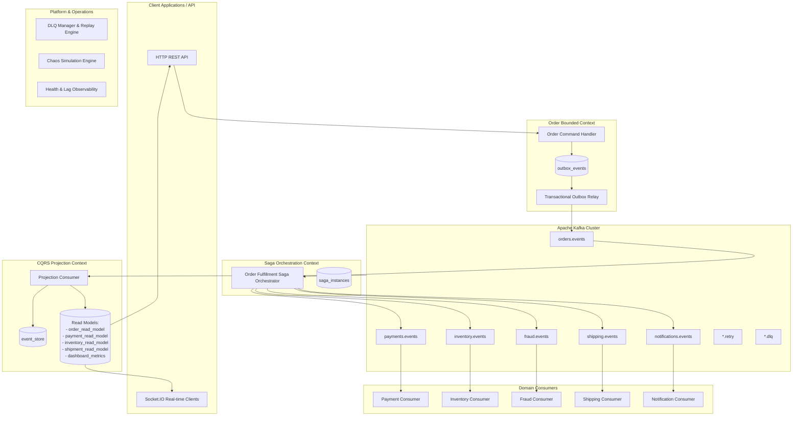

# 00. Architecture Audit & Assessment

**Date:** 2026-09-21  
**Author:** Giovani Rodrigo  
**Repository:** [event-driven-kafka](https://github.com/GiovaniRodrigo/event-driven-kafka)  
**Status:** APPROVED — Baseline Audit Complete  

---

## 1. Executive Summary

This audit establishes the baseline technical assessment of the `event-driven-kafka` repository. The existing codebase implements a basic, working demonstration of event choreography across four stages (`orders` → `payments` → `inventory` → `notifications`) with PostgreSQL persistence and a Socket.IO real-time bridge.

While the foundation is functional and includes commendable host resource calibration (`scripts/start.sh` + `scripts/watchdog.sh`), it contains critical architectural gaps in distributed systems reliability:
* **Dual-Write Vulnerability** (lacks Transactional Outbox pattern).
* **Fragile In-Memory Retry & Primitive DLQ** (retry counts in RAM, no exponential backoff/jitter, missing DLQ replay API).
* **Missing Saga Orchestrator & Compensating Transactions** (no rollback/refund when inventory or fraud checks fail).
* **Incomplete Event Contracts & Causation Tracking** (no standardized event envelope, missing Zod validation at Kafka boundary, ad-hoc event payloads).
* **Monolithic Shared State & Missing CQRS Read Models** (direct mutation of `orders` table across all consumers instead of decoupled domain projections).
* **No Controlled Failure / Chaos Simulation Engine** (cannot systematically demonstrate failure modes and self-healing).
* **Absence of Event Sourcing / Event Replay Mechanisms** (cannot rebuild state from the event log).

---

## 2. Current State Inventory

### 2.1 Technology Stack
* **Runtime:** Node.js 20.x, TypeScript 5.1.3 (strict mode disabled)
* **Messaging:** Apache Kafka 7.5.0 (Confluent Platform) via `kafkajs` 2.2.4
* **Coordination:** Apache ZooKeeper 7.5.0
* **Persistence:** PostgreSQL 15 (Alpine) via `pg` 8.11.1
* **API / Realtime:** Express 4.18.2, Socket.IO 4.8.3
* **Validation:** Zod 3.25.76 (only used in Socket.IO contract)
* **Testing:** Jest 29.5.0, ts-jest 29.1.0, supertest 6.3.4
* **Containers:** Docker Compose with per-service CPU/RAM ceilings and self-calibrating memory watchdog.

### 2.2 Existing Kafka Topics
| Topic Name | Partitions | Replication | Purpose in Baseline Code | Deficiencies |
| :--- | :---: | :---: | :--- | :--- |
| `orders` | 3 | 1 | Carries `order.created` | Ad-hoc payload, no schema versioning |
| `payments` | 3 | 1 | Carries `payment.approved` | No payment failure or refund events |
| `inventory` | 3 | 1 | Carries `inventory.reserved` | No inventory failure/release events |
| `notifications` | 1 | 1 | Carries `notification.sent` | Terminal event only |
| `dlq` | 1 | 1 | Fallback for failed messages | Unstructured error schema, no replay |

### 2.3 Existing Database Schema
```sql
-- kafka_topics: Metadata table
CREATE TABLE kafka_topics (name VARCHAR(100) PRIMARY KEY, created_at TIMESTAMP);

-- orders: Monolithic mutable state
CREATE TABLE orders (
  id VARCHAR(50) PRIMARY KEY,
  user_id VARCHAR(50) NOT NULL,
  status VARCHAR(50) NOT NULL DEFAULT 'pending',
  total_amount DECIMAL(10, 2) NOT NULL,
  metadata JSONB,
  created_at TIMESTAMP NOT NULL DEFAULT CURRENT_TIMESTAMP,
  updated_at TIMESTAMP NOT NULL DEFAULT CURRENT_TIMESTAMP
);

-- order_events: Shallow timeline table
CREATE TABLE order_events (
  id SERIAL PRIMARY KEY,
  order_id VARCHAR(50) NOT NULL,
  event_type VARCHAR(100) NOT NULL,
  topic VARCHAR(100) NOT NULL,
  created_at TIMESTAMP NOT NULL DEFAULT CURRENT_TIMESTAMP
);

-- processed_events: Global deduplication
CREATE TABLE processed_events (
  event_id VARCHAR(100) PRIMARY KEY,
  processed_at TIMESTAMP NOT NULL DEFAULT CURRENT_TIMESTAMP
);

-- metrics: Primitive key/value metrics
CREATE TABLE metrics (
  id SERIAL PRIMARY KEY,
  metric_name VARCHAR(100) NOT NULL,
  value DECIMAL(15, 2) NOT NULL,
  timestamp TIMESTAMP NOT NULL DEFAULT CURRENT_TIMESTAMP
);
```

---

## 3. Detailed Architectural & Technical Debt Analysis

### 3.1 Dual-Write Anti-Pattern (Lack of Outbox)
In `src/services/order-service.ts`:
```typescript
await this.db.insertOrder(order);
await this.db.recordEvent(orderId, 'order.created', 'orders');
await this.producer.emit('order.created', ...);
```
**Risk:** If the database insert succeeds and the Kafka cluster is temporarily unreachable or the Node process crashes before `producer.emit`, the order is written to Postgres but never published to Kafka. The order hangs forever in `pending`. Conversely, if Kafka publish succeeds but a database error occurs, ghost messages propagate downstream.
**Remedy:** Implement **Transactional Outbox Pattern** with an atomic DB transaction writing the aggregate + outbox record, combined with a background polling/event-driven Outbox Relay.

### 3.2 In-Memory Consumer State & Faulty Retries
In `src/consumers/base-consumer.ts`:
```typescript
protected retryCount: Map<string, number> = new Map();
```
**Risk:**
1. In-memory `retryCount` is lost on consumer crash/restart, potentially causing infinite retry loops.
2. Retries are executed immediately (no exponential backoff or jitter), causing retry storms on downstream dependencies.
3. No retry topics (`orders.retry`, `payments.retry`, etc.) to allow non-blocking retries.
**Remedy:** Implement persistent retry tracking with exponential backoff and jitter, dedicated retry topics, and dead-letter queue routing with complete failure context.

### 3.3 Flawed Idempotency Model
`processed_events` only stores `(event_id)`.
**Risk:** In microservices and multi-consumer systems, the same event is legitimately read by multiple independent consumer groups (e.g. `PaymentConsumer` and `OrderProjectionConsumer`). A global primary key on `event_id` alone causes one consumer to mark the event processed, preventing another consumer from processing it.
**Remedy:** Schema must enforce `UNIQUE(event_id, consumer_name)` and store `status`, `error`, and `attempts`.

### 3.4 Missing Saga Orchestration & Compensations
The existing system relies on linear choreography without failure recovery:
`OrderCreated` → `PaymentApproved` → `InventoryReserved` → `NotificationSent` (Completed).
**Deficiencies:**
* If payment fails: Order remains `pending`.
* If inventory is out of stock after payment is captured: Money is held, order never completes, no refund is triggered (`PaymentRefundRequested`), and no compensating transaction occurs.
* No Fraud Detection context.
* No Shipping context.
**Remedy:** Implement a persistent **Saga Orchestrator** managing a state machine with full forward actions and compensating actions (`PaymentRefunded`, `InventoryReleased`, `OrderCancelled`, `OrderFailed`).

### 3.5 Schema Evolution & Event Contract Gaps
Events lack standardized envelopes, aggregate types, causation IDs, schema versions, and producer IDs.
**Remedy:** Standardize the event envelope using Zod with fields: `event_id`, `event_type`, `event_version`, `aggregate_id`, `aggregate_type`, `occurred_at`, `producer`, `correlation_id`, `causation_id`, `schema_version`, and validated `payload`.

### 3.6 CQRS & Read Model Deficiencies
Direct mutations on `orders` table mix command and query concerns.
**Remedy:** Implement explicit CQRS with separated command handlers and query read models (`order_read_model`, `payment_read_model`, `inventory_read_model`, `shipment_read_model`, `dashboard_metrics`) updated purely via event projections.

### 3.7 Lack of Event Replay & State Reconstruction
There is no mechanism to rewind consumer offsets or replay events from the event store to rebuild corrupted projections or reprocess dead letters.
**Remedy:** Implement an Event Replay engine supporting replay by aggregate, topic, or time range.

### 3.8 Missing Chaos Engineering Controls
Currently, failure handling cannot be verified without modifying application code.
**Remedy:** Create a controlled chaos engine with REST endpoints (`POST /chaos/:service/failure`, `GET /chaos/status`, `POST /chaos/reset`) disabled by default.

---

## 4. Bounded Context Target Blueprint



---

## 5. Migration & Implementation Phasing

* **Phase 0:** Audit & Assessment (`docs/00_ARCHITECTURE_AUDIT.md`) — **[COMPLETED]**
* **Phase 1:** Architecture & Standardized Event Contracts (`src/contracts/`, Zod schemas, topics catalog).
* **Phase 2:** Transactional Outbox Pattern & Relay Engine (`outbox_events`, polling/relay loop).
* **Phase 3:** Robust Idempotent Consumer Pattern (`processed_events` with consumer isolation).
* **Phase 4:** Exponential Backoff Retry & Dead Letter Queue (DLQ manager + API).
* **Phase 5:** Saga Orchestrator & Compensating Transactions (`saga_instances`, rollback logic).
* **Phase 6:** CQRS Read Models, Projections & Event History Store (`event_store`, read model tables).
* **Phase 7:** Event Replay Engine (aggregate, topic, and temporal replay).
* **Phase 8:** Real-time Observability, Consumer Lag & Metrics Dashboard.
* **Phase 9:** Chaos Engineering & Failure Simulation Controls.
* **Phase 10:** Testing Pyramid (Unit, Integration, E2E, Failure Scenarios, k6 Load Tests).
* **Phase 11:** Production Hardening, Graceful Shutdown, Security & Resource Limits.
* **Phase 12:** Comprehensive Documentation, Diagrams & Final Implementation Report.

---

## 6. Audit Conclusion & Approval

The baseline codebase provides an operational starting point. The proposed migration path will systematically elevate this repository into a definitive, production-grade reference implementation for Event-Driven Architecture with Apache Kafka.
