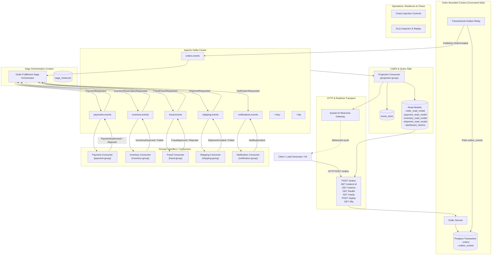
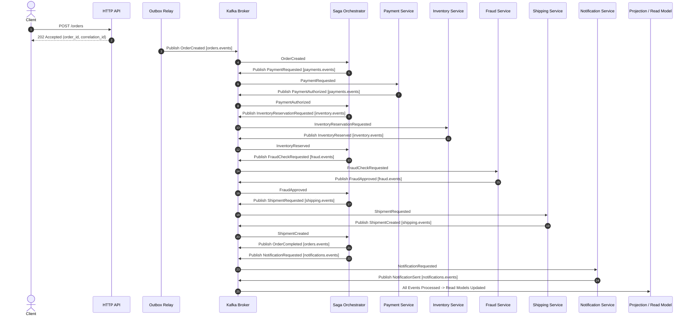
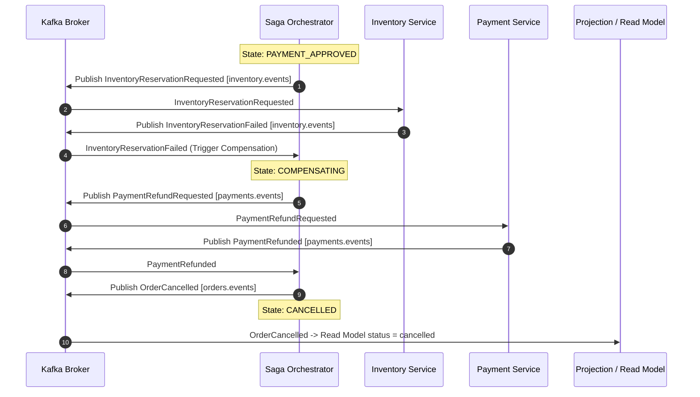

# 01. System Architecture & Event-Driven Topology

**Version:** 1.0.0  
**Author:** Giovani Rodrigo  
**Status:** IMPLEMENTED  

---

## 1. Architectural Philosophy

This platform implements an end-to-end **Event-Driven Architecture (EDA)** for an e-commerce order fulfillment lifecycle. It enforces strict distributed systems patterns to eliminate data inconsistency, phantom messages, duplicate processing, and unhandled failure states.

### Core Principles:
1. **Asynchronous Autonomy:** Commands are accepted via HTTP `202 Accepted` and immediately handed off to the event stream. Bounded contexts communicate purely via asynchronous Kafka events.
2. **Atomic State & Publication (Transactional Outbox):** No dual-write vulnerabilities. Aggregate changes and their resulting domain events are persisted within a single local database transaction.
3. **Idempotent Consumers:** Every consumer safely survives message duplication, replay, rebalances, and network retries using isolated, persistent deduplication guards.
4. **Coordinated Consistency (Saga Pattern):** A persistent Saga Orchestrator manages the multi-step fulfillment workflow across Payment, Inventory, Fraud, and Shipping, executing automated compensating transactions on failure.
5. **Command-Query Responsibility Segregation (CQRS):** Write operations append events and update outbox records; read queries query dedicated, re-projectable read models.
6. **Observability & Traceability:** Every event carries a universal envelope with `correlation_id`, `causation_id`, `event_id`, and `occurred_at`, enabling end-to-end distributed tracing.

---

## 2. High-Level System Architecture Diagram

---

## 3. Order Fulfillment State Machine & Event Flow

### 3.1 Happy Path (Successful Fulfillment)

### 3.2 Failure & Compensating Transactions

---

## 4. Bounded Context Boundaries

1. **Order Context (`src/domain/order`):**
   * Manages order lifecycle initiation, validates initial payload, records state to DB, writes to `outbox_events`.
2. **Payment Context (`src/domain/payment`):**
   * Authorizes charges, performs payment captures, executes refunds for cancelled orders.
3. **Inventory Context (`src/domain/inventory`):**
   * Manages SKU stock levels, processes atomic stock reservations, releases reserved stock on compensation.
4. **Fraud Context (`src/domain/fraud`):**
   * Analyzes order metadata and risk factors, issues approvals or fraud rejections.
5. **Shipping Context (`src/domain/shipping`):**
   * Allocates tracking numbers, connects to carriers, dispatches deliveries.
6. **Notification Context (`src/domain/notification`):**
   * Formats and dispatches transactional communications (Email, SMS, Push).
7. **Saga Orchestrator (`src/saga`):**
   * Central coordinator of the distributed transaction, maintains persistent state in `saga_instances`.
8. **Projection Context (`src/application/projections`):**
   * Listens to all domain topics, maintains immutable `event_store` history, builds materialized views.
9. **Platform & Operations (`src/observability`, `src/chaos`, `src/dlq`):**
   * Health checks, readiness probes, dead-letter inspection, fault injection, event replay.
