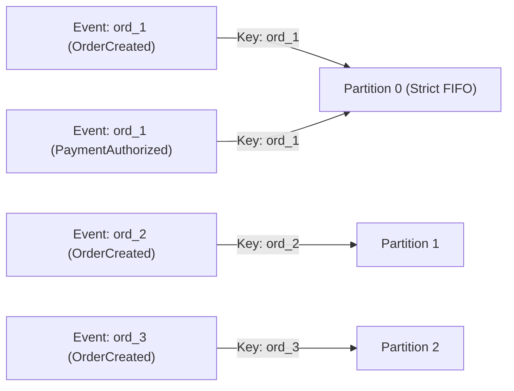

# 02. Kafka Topic Catalog & Partitioning Strategy

**Version:** 1.0.0  
**Author:** Giovani Rodrigo  
**Status:** IMPLEMENTED  

---

## 1. Topic Taxonomy Standard

All topics in this platform adhere to strict naming and partitioning standards:
* **Format:** `<domain>.events` for primary domain event streams.
* **Format:** `<domain>.retry` for non-blocking retry streams with exponential backoff.
* **Format:** `<domain>.dlq` for unprocessable dead-letter messages.
* **Format:** `platform.<action>` for operational and control events.

---

## 2. Topic Catalog

| Topic Name | Partitions | Replication | Retention (ms) | Key Strategy | Producers | Consumers | Payload Schema |
| :--- | :---: | :---: | :---: | :--- | :--- | :--- | :--- |
| **`orders.events`** | 3 | 1 | 604800000 (7d) | `order_id` / `aggregate_id` | Outbox Relay, Saga Orchestrator | Saga Orchestrator, Projection Consumer | `OrderCreated`, `OrderCancelled`, `OrderCompleted`, `OrderFailed` |
| **`payments.events`** | 3 | 1 | 604800000 (7d) | `order_id` / `aggregate_id` | Saga Orchestrator, Payment Consumer | Payment Consumer, Saga Orchestrator, Projection Consumer | `PaymentRequested`, `PaymentAuthorized`, `PaymentRejected`, `PaymentRefundRequested`, `PaymentRefunded` |
| **`inventory.events`** | 3 | 1 | 604800000 (7d) | `order_id` / `aggregate_id` | Saga Orchestrator, Inventory Consumer | Inventory Consumer, Saga Orchestrator, Projection Consumer | `InventoryReservationRequested`, `InventoryReserved`, `InventoryReservationFailed`, `InventoryReleased` |
| **`fraud.events`** | 3 | 1 | 604800000 (7d) | `order_id` / `aggregate_id` | Saga Orchestrator, Fraud Consumer | Fraud Consumer, Saga Orchestrator, Projection Consumer | `FraudCheckRequested`, `FraudApproved`, `FraudRejected` |
| **`shipping.events`** | 3 | 1 | 604800000 (7d) | `order_id` / `aggregate_id` | Saga Orchestrator, Shipping Consumer | Shipping Consumer, Saga Orchestrator, Projection Consumer | `ShipmentRequested`, `ShipmentCreated`, `ShipmentFailed` |
| **`notifications.events`** | 3 | 1 | 604800000 (7d) | `order_id` / `aggregate_id` | Saga Orchestrator, Notification Consumer | Notification Consumer, Projection Consumer | `NotificationRequested`, `NotificationSent` |
| **`orders.retry`** | 3 | 1 | 86400000 (1d) | `order_id` / `aggregate_id` | Consumer Retry Handlers | Retry Workers | Standard Event Envelope with Retry Headers |
| **`payments.retry`** | 3 | 1 | 86400000 (1d) | `order_id` / `aggregate_id` | Consumer Retry Handlers | Retry Workers | Standard Event Envelope with Retry Headers |
| **`inventory.retry`** | 3 | 1 | 86400000 (1d) | `order_id` / `aggregate_id` | Consumer Retry Handlers | Retry Workers | Standard Event Envelope with Retry Headers |
| **`fraud.retry`** | 3 | 1 | 86400000 (1d) | `order_id` / `aggregate_id` | Consumer Retry Handlers | Retry Workers | Standard Event Envelope with Retry Headers |
| **`shipping.retry`** | 3 | 1 | 86400000 (1d) | `order_id` / `aggregate_id` | Consumer Retry Handlers | Retry Workers | Standard Event Envelope with Retry Headers |
| **`platform.dlq`** | 1 | 1 | 2592000000 (30d) | `event_id` / `aggregate_id` | Base Consumer Error Handler | DLQ Manager, Replay Engine | `DLQEnvelope` with stack trace & error metadata |
| **`platform.events`** | 1 | 1 | 604800000 (7d) | `correlation_id` | Operations Engine, Chaos Engine | Dashboard, Metrics Collector | Platform health, chaos events, configuration changes |
| **`replay.events`** | 1 | 1 | 86400000 (1d) | `replay_id` | Replay Engine | Target Projection Consumers | Replay Command & Replayed Event Wrappers |

---

## 3. Partitioning Strategy

### 3.1 Strict In-Order Processing per Aggregate
* In Apache Kafka, strict ordering is guaranteed **only within a single partition**.
* To guarantee that all state changes for an order (`OrderCreated` → `PaymentAuthorized` → `InventoryReserved` → `OrderCompleted`) are consumed in exact sequential order without race conditions, the message key is always set to the `aggregate_id` (i.e. `order_id`).
* Kafka uses `Murmur2(key) % num_partitions` to consistently route all events of a specific order to the exact same partition.

### 3.2 Consumer Parallelism
With 3 partitions per topic, up to 3 consumer instances per Consumer Group can process messages in parallel. Adding more consumers than partitions in a group leaves excess consumers idle until a rebalance occurs.
