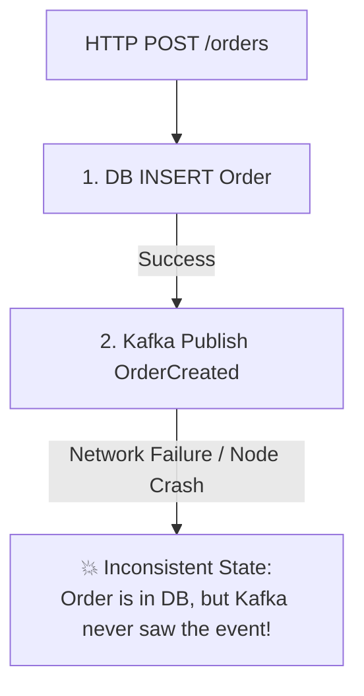
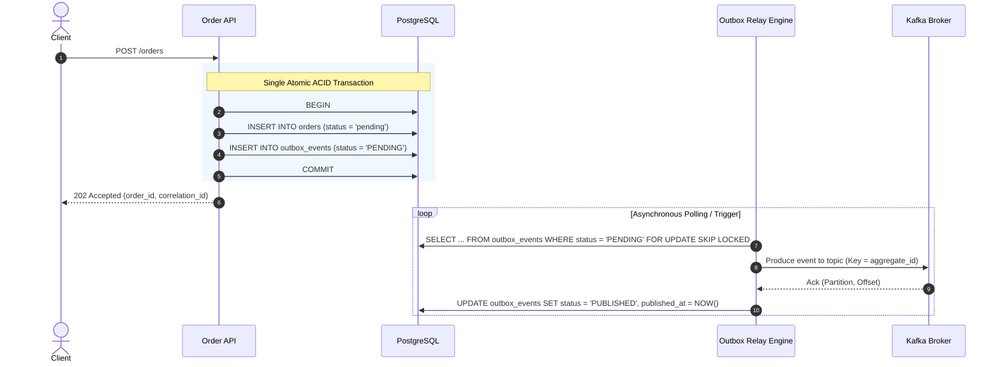

# 04. Transactional Outbox Pattern & Relay Engine

**Version:** 1.0.0  
**Author:** Giovani Rodrigo  
**Status:** IMPLEMENTED  

---

## 1. Problem Statement: The Dual-Write Hazard

In distributed systems, updating a local database and publishing a message to a broker as two distinct, uncoordinated steps introduces a critical consistency flaw:



If the database commit succeeds but the process terminates or Kafka fails before publishing, downstream services (Payment, Inventory, Shipping) are never notified. The order hangs forever in a zombie state.

---

## 2. Solution: The Transactional Outbox Pattern

The **Transactional Outbox Pattern** guarantees atomic state transition and event generation by co-locating the business state update and the domain event in the same local relational database transaction:



---

## 3. Database Schema: `outbox_events`

```sql
CREATE TABLE outbox_events (
  id VARCHAR(100) PRIMARY KEY,
  aggregate_id VARCHAR(100) NOT NULL,
  aggregate_type VARCHAR(50) NOT NULL,
  event_type VARCHAR(100) NOT NULL,
  event_version INT NOT NULL DEFAULT 1,
  payload JSONB NOT NULL,
  correlation_id VARCHAR(100) NOT NULL,
  causation_id VARCHAR(100) NOT NULL,
  topic VARCHAR(100) NOT NULL,
  status VARCHAR(20) NOT NULL DEFAULT 'PENDING',
  attempts INT NOT NULL DEFAULT 0,
  last_error TEXT,
  created_at TIMESTAMP NOT NULL DEFAULT CURRENT_TIMESTAMP,
  published_at TIMESTAMP
);

CREATE INDEX idx_outbox_pending
ON outbox_events (status, created_at)
WHERE status = 'PENDING';
```

---

## 4. Outbox Relay Concurrency & Guarantees

### 4.1 Non-Blocking Concurrency (`FOR UPDATE SKIP LOCKED`)
Multiple outbox relay worker processes or threads can safely run concurrently. By executing `FOR UPDATE SKIP LOCKED`, each worker locks a unique slice of pending events without blocking or contending with peer workers.

### 4.2 At-Least-Once Delivery Guarantee
If an outbox worker crashes after Kafka acknowledges the message but before updating PostgreSQL to `PUBLISHED`, the next polling iteration will redeliver the event. Downstream consumers eliminate duplicate deliveries via their **Idempotent Consumer Guards** (`processed_events`).
