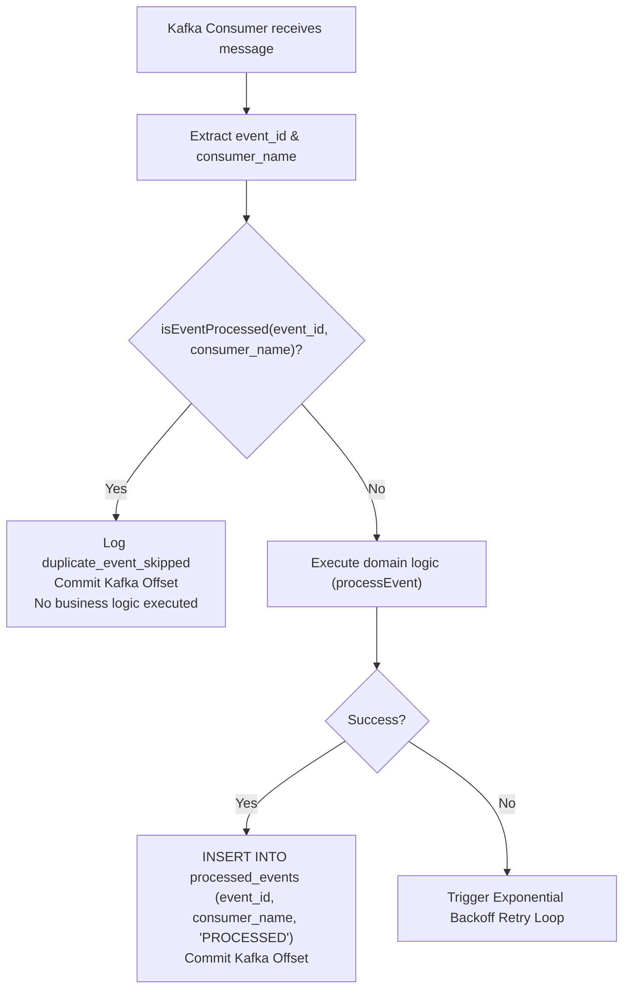

# 05. Idempotent Consumers & Deduplication Engine

**Version:** 1.0.0  
**Author:** Giovani Rodrigo  
**Status:** IMPLEMENTED  

---

## 1. The Distributed Message Duplication Problem

In Apache Kafka and distributed message brokers, network partitions, consumer group rebalances, and process restarts inevitably cause **At-Least-Once Delivery**:
1. A consumer processes a message and performs business operations (e.g. captures payment).
2. Before the consumer can commit the offset back to Kafka, the broker crashes or the network blips.
3. Kafka rebalances the partition and delivers the same message offset again.
4. Without idempotency guards, the customer would be charged twice.

---

## 2. Solution: Scoped Idempotent Consumer Pattern

To guarantee safety across multiple consumer groups reading the same event, deduplication cannot rely solely on `event_id` globally. It requires **Consumer-Scoped Idempotency**:

```sql
CREATE TABLE processed_events (
  id SERIAL PRIMARY KEY,
  event_id VARCHAR(100) NOT NULL,
  consumer_name VARCHAR(100) NOT NULL,
  status VARCHAR(50) NOT NULL DEFAULT 'PROCESSED',
  attempts INT NOT NULL DEFAULT 1,
  error TEXT,
  processed_at TIMESTAMP NOT NULL DEFAULT CURRENT_TIMESTAMP,
  CONSTRAINT uq_event_consumer UNIQUE (event_id, consumer_name)
);

CREATE INDEX idx_processed_lookup
ON processed_events (event_id, consumer_name);
```

### Processing Flow:



---

## 3. Crash & Rebalance Resilience

1. **Independent Consumer Group Isolation:** `PaymentConsumer` and `OrderProjectionConsumer` independently process the same `OrderCreated` event without collision because `UNIQUE (event_id, consumer_name)` isolates their idempotency state.
2. **Crash Before Offset Commit:** If the consumer crashes after writing to `processed_events`, on recovery Kafka redelivers the event, the consumer checks `processed_events`, finds the entry, and safely skips duplicate execution.
