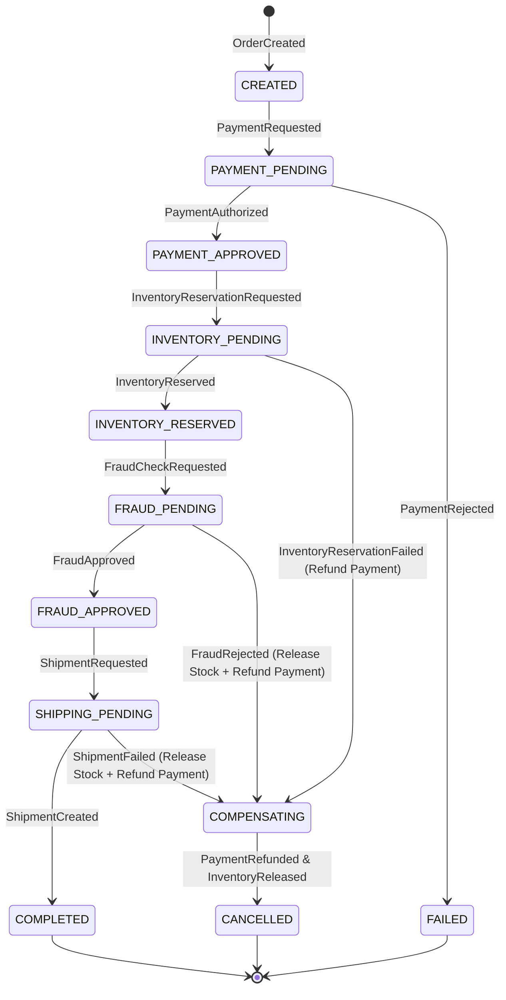

# 06. Saga Pattern & Distributed Transactions

**Version:** 1.0.0  
**Author:** Giovani Rodrigo  
**Status:** IMPLEMENTED  

---

## 1. Why Saga? The Distributed Consistency Challenge

In a microservices or modular event-driven architecture, a single business action ("Order Fulfillment") spans multiple bounded contexts (Payment, Inventory, Fraud, Shipping). Traditional two-phase commits (2PC) introduce tight coupling, single points of failure, and unacceptable latency.

The **Saga Pattern** solves this by breaking the distributed transaction into a sequence of local transactions coordinated through asynchronous events, accompanied by explicit **compensating transactions** if any step fails.

---

## 2. Saga Orchestrator Architecture

This platform implements an **Orchestrated Saga** (`SagaOrchestrator`) backed by persistent PostgreSQL state (`saga_instances` table):



---

## 3. Forward Actions vs. Compensating Actions

| Saga Step | Forward Event | Success Response | Failure Response | Compensating Action |
| :--- | :--- | :--- | :--- | :--- |
| **1. Payment** | `PaymentRequested` | `PaymentAuthorized` | `PaymentRejected` | *(None needed — no money captured)* |
| **2. Inventory** | `InventoryReservationRequested` | `InventoryReserved` | `InventoryReservationFailed` | `PaymentRefundRequested` → `PaymentRefunded` |
| **3. Fraud Check** | `FraudCheckRequested` | `FraudApproved` | `FraudRejected` | `InventoryReleased` + `PaymentRefundRequested` |
| **4. Shipping** | `ShipmentRequested` | `ShipmentCreated` | `ShipmentFailed` | `InventoryReleased` + `PaymentRefundRequested` |
| **5. Completion** | `OrderCompleted` | `NotificationSent` | *(Terminal)* | *(Terminal)* |

---

## 4. Persistent State Schema: `saga_instances`

```sql
CREATE TABLE saga_instances (
  saga_id VARCHAR(100) PRIMARY KEY,
  aggregate_id VARCHAR(100) NOT NULL,
  saga_type VARCHAR(100) NOT NULL,
  state VARCHAR(50) NOT NULL,
  current_step VARCHAR(50) NOT NULL,
  correlation_id VARCHAR(100) NOT NULL,
  context JSONB NOT NULL DEFAULT '{}'::jsonb,
  failure_reason TEXT,
  created_at TIMESTAMP NOT NULL DEFAULT CURRENT_TIMESTAMP,
  updated_at TIMESTAMP NOT NULL DEFAULT CURRENT_TIMESTAMP
);
```

### Crash Recovery Guarantee
Because the Saga Orchestrator stores its state machine after every single transition in PostgreSQL, an orchestrator process restart or Kubernetes pod eviction resumes execution from the exact persisted step upon consumer rebalance.
