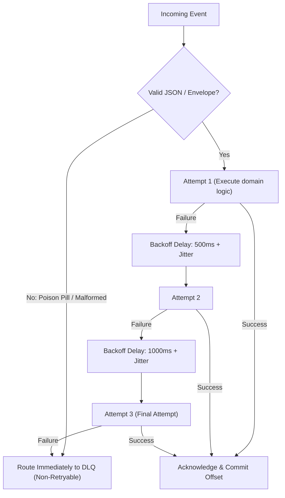

# 09. Retry Strategy & Dead Letter Queue (DLQ)

**Version:** 1.0.0  
**Author:** Giovani Rodrigo  
**Status:** IMPLEMENTED  

---

## 1. Retry Strategy Architecture

Uncontrolled retries (e.g. `while(true)`) create catastrophic retry storms that saturate database connection pools and Kafka brokers. This platform implements a multi-tier retry policy:



### Exponential Backoff Formula:
$$\text{Delay} = \min(\text{MaxBackoff}, \text{BaseMs} \times 2^{\text{attempt} - 1}) + \text{random}(0, \text{JitterMs})$$
* **Base:** 500ms
* **Jitter:** 200ms
* **Max Retries:** 3

---

## 2. Dead Letter Queue Structure

When an event permanently fails all retries, the consumer publishes the complete failure payload to `platform.dlq` and persists a record to `dlq_messages`.

### Schema: `dlq_messages`
```sql
CREATE TABLE dlq_messages (
  id VARCHAR(100) PRIMARY KEY,
  event_id VARCHAR(100) NOT NULL,
  topic VARCHAR(100) NOT NULL,
  partition INT NOT NULL,
  offset_val VARCHAR(50) NOT NULL,
  consumer_name VARCHAR(100) NOT NULL,
  error_message TEXT NOT NULL,
  stack_trace TEXT,
  payload JSONB NOT NULL,
  correlation_id VARCHAR(100),
  attempts INT NOT NULL DEFAULT 1,
  status VARCHAR(50) NOT NULL DEFAULT 'UNRESOLVED',
  failed_at TIMESTAMP NOT NULL DEFAULT CURRENT_TIMESTAMP,
  resolved_at TIMESTAMP
);
```

---

## 3. Operational DLQ API

* **`GET /dlq`**: List all unresolved dead-letter messages.
* **`GET /dlq/:id`**: Inspect specific DLQ message with complete stack trace and original event payload.
* **`POST /dlq/:id/replay`**: Explicitly replay a dead-letter message back to its original target topic or target consumer.
