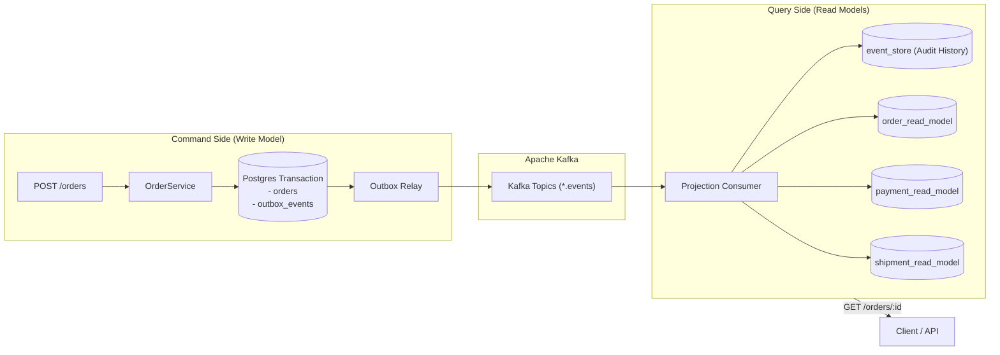

# 10. CQRS & Read Model Projections

**Version:** 1.0.0  
**Author:** Giovani Rodrigo  
**Status:** IMPLEMENTED  

---

## 1. CQRS Philosophy

Command Query Responsibility Segregation (CQRS) decouples the write model (optimized for consistency, concurrency validation, and outbox persistence) from the read models (optimized for low-latency queries, UI rendering, and operational dashboards).

---

## 2. Asynchronous Read Model Projections

1. **`order_read_model`**: Materialized view of current order state, line items, associated payment IDs, tracking numbers, and compensation failure reasons.
2. **`payment_read_model`**: Financial ledger of authorized charges, payment gateways, and refund IDs.
3. **`inventory_read_model`**: Stock tracking with reserved vs available balances.
4. **`shipment_read_model`**: Carrier status, tracking numbers, and delivery estimates.

---

## 3. Projection Self-Healing via Event Sourcing

Because every single domain event is appended to the immutable `event_store` table, read models are 100% disposable. If a projection becomes corrupted or new query models are introduced, the **Event Replay Engine** can reconstruct the read model from scratch by replaying the event store.
