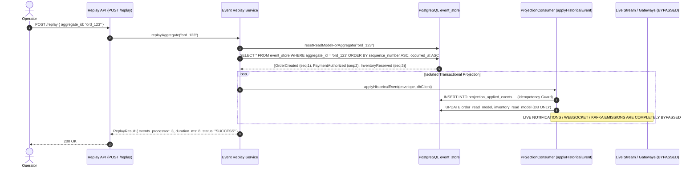

# 11. Event Replay & State Reconstruction Engine

**Version:** 2.0.0  
**Author:** Giovani Rodrigo ([giovanif245@gmail.com](mailto:giovanif245@gmail.com))  
**Status:** IMPLEMENTED & PRODUCTION HARDENED (DISTRIBUTED FAILURE VERIFIED)  

---

## 1. Executive Replay Architecture Overview

Event Replay in this architecture allows the platform to deterministically reconstruct materialized views (CQRS read models), re-evaluate state aggregates, and recover from poison pills or consumer bugs without introducing corrupting side effects (such as duplicate emails, extraneous WebSocket events, or duplicate inventory deductions).

### Core Use Cases:
1. **Materialized View Reconstruction:** Rebuilding `order_read_model`, `inventory_read_model`, `payment_read_model`, and `shipment_read_model` from scratch following schema changes, data corruption, or code deployments.
2. **Deterministic Aggregate Reprocessing:** Re-applying all historical domain events for a specific `order_id` in strict total chronological order (`sequence_number ASC`).
3. **Dead Letter Recovery:** Re-submitting an isolated failed event from the Dead Letter Queue (`dlq_messages`) back to its target Kafka topic after applying fixes to upstream schemas or downstream handlers.



---

## 2. Safety Guards Against Replay Anomalies

Historical replay in distributed systems poses severe hazards if not isolated. The platform implements five foundational safety mechanisms:

### 2.1. Complete Side-Effect Isolation (`applyHistoricalEvent` vs `emitLiveNotifications`)
- **Live Stream Processing (`processEvent`):** When events arrive live from Kafka partitions, `ProjectionConsumer` performs two steps:
  1. `applyHistoricalEvent(event, client)`: Updates the PostgreSQL read model tables and records the event in `projection_applied_events`.
  2. `emitLiveNotifications(event)`: Emits real-time WebSocket telemetry via `RealtimeGateway` (e.g., `gateway.orderCreated`, `gateway.orderUpdated`).
- **Historical Replay Processing (`replayAggregate`):** When rebuilding projections from `event_store`, the engine invokes **`applyHistoricalEvent` directly** within an explicit database transaction (`BEGIN ... COMMIT`).
- **Zero External Egress:** During replay, zero calls are made to `RealtimeGateway`, zero messages are published to Kafka, and zero outbound network calls are executed.

### 2.2. Projection Idempotency Boundary (`projection_applied_events`)
To prevent duplicate state mutations during replay or concurrent consumer executions:
```sql
CREATE TABLE IF NOT EXISTS projection_applied_events (
  id SERIAL PRIMARY KEY,
  projection_name VARCHAR(100) NOT NULL,
  event_id VARCHAR(100) NOT NULL,
  applied_at TIMESTAMP NOT NULL DEFAULT CURRENT_TIMESTAMP,
  CONSTRAINT uq_projection_event UNIQUE (projection_name, event_id)
);
```
Before applying any mutation (e.g., deducting or restoring available stock), `applyHistoricalEvent` attempts to insert into `projection_applied_events`. If a duplicate `event_id` is encountered for the same projection, the operation is skipped deterministically.

### 2.3. Deterministic Stream Total Ordering (`sequence_number ASC`)
Historical event streams are retrieved with:
```sql
SELECT * FROM event_store 
WHERE aggregate_id = $1 
ORDER BY sequence_number ASC, occurred_at ASC;
```
Because sequence numbers are monotonic integers enforced by PostgreSQL advisory locks and unique constraints (`UNIQUE(aggregate_id, sequence_number)`), replaying an event stream produces identical deterministic read model state on every run.

### 2.4. Scoped Aggregate Targets
The replay engine requires an explicit target scope (`aggregate_id` or `dlq_id`). Arbitrary bulk table overwrites without scoping are prevented.

### 2.5. Replay Audit Trail
Every replay invocation produces a structured log entry and audit record containing `replay_id`, `aggregate_id`, `events_count`, `duration_ms`, and `initiated_by`.

---

## 3. Dead Letter Queue (DLQ) Recovery vs Aggregate Replay

| Dimension | Aggregate Historical Replay | Dead Letter Queue (DLQ) Replay |
| :--- | :--- | :--- |
| **Source of Truth** | Immutable `event_store` | Quarantined `dlq_messages` table |
| **Trigger Method** | `POST /replay { aggregate_id: "ord_123" }` | `POST /dlq/:id/replay` |
| **Mechanism** | In-process invocation of `applyHistoricalEvent` in DB tx | Republishing raw envelope to original Kafka topic |
| **Idempotency Reset** | Reads `projection_applied_events` | Executes `resetProcessedEventForReplay` on `processed_events` |
| **Side Effects** | Zero external side effects (DB updates only) | Normal live consumer execution after topic republication |

---

## 4. Verification Evidence

1. **Unit Verification (`tests/unit/replay-determinism.test.ts`):** Verifies that replaying historical streams does not double-count inventory mutations or produce corrupted read models.
2. **Integration Verification (`tests/integration/replay-rebuild.integration.test.ts`):** Proves deterministic projection reconstruction with zero external side effects and identical read-model state before and after replay against PostgreSQL.
3. **Failure Injection Verification (`tests/unit/failure-injection.test.ts`):** Validates that `applyHistoricalEvent` skips WebSocket and external emissions entirely during historical reconstruction.
