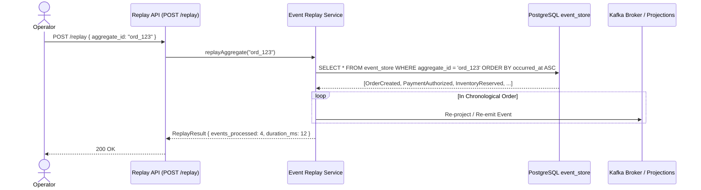

# 11. Event Replay & State Reconstruction Engine

**Version:** 1.0.0  
**Author:** Giovani Rodrigo  
**Status:** IMPLEMENTED  

---

## 1. Replay Capabilities

Event Replay allows the platform to re-evaluate historical events from the immutable `event_store` or dead-letter queues.

### Supported Use Cases:
1. **Projection Reconstruction:** Rebuilding `order_read_model` after a code upgrade or corruption.
2. **Aggregate Reprocessing:** Re-running events for a specific `order_id`.
3. **Dead Letter Recovery:** Re-submitting a resolved dead-letter event back to its origin Kafka topic after a downstream bugfix.

---

## 2. Safety Guards Against Accidental Replay
* **Scoped Target:** Replays must explicitly specify an `aggregate_id` or `dlq_id`.
* **Idempotency Bypass Mode:** When rebuilding read models, replay specifically updates projections without generating secondary forward command events.
* **Audit Logging:** Every replay operation generates a unique `replay_id` and structured audit log entry.
