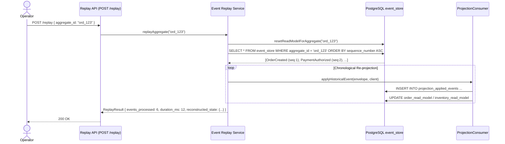

# 11. Event Replay & State Reconstruction Engine

**Version:** 1.1.0  
**Author:** Giovani Rodrigo  
**Status:** IMPLEMENTED & PRODUCTION HARDENED  

---

## 1. Replay Capabilities

Event Replay allows the platform to re-evaluate historical events from the immutable `event_store` or dead-letter queues.

### Supported Use Cases:
1. **Projection Reconstruction:** Rebuilding `order_read_model` and associated models after a code upgrade or corruption.
2. **Aggregate Reprocessing:** Re-running events for a specific `order_id` in deterministic sequence order (`sequence_number ASC`).
3. **Dead Letter Recovery:** Re-submitting a resolved dead-letter event back to its origin Kafka topic after a downstream bugfix.

---

## 2. Safety Guards Against Accidental Replay
* **Scoped Target:** Replays must explicitly specify an `aggregate_id` or `dlq_id`.
* **Isolated Projection Handler (`applyHistoricalEvent`):** Historical replays bypass live event store appending and websocket emissions, directly rebuilding read models in isolated transactions.
* **Projection Idempotency (`projection_applied_events`):** Replayed events track their application in `projection_applied_events(projection_name, event_id)` to prevent double-counting incremental mutations (e.g. inventory reservations).
* **Deterministic Sequencing:** Event streams are fetched with `ORDER BY sequence_number ASC, occurred_at ASC`, ensuring repeatable reconstructed states.
* **Audit Logging:** Every replay operation generates a unique `replay_id` and structured audit log entry.
