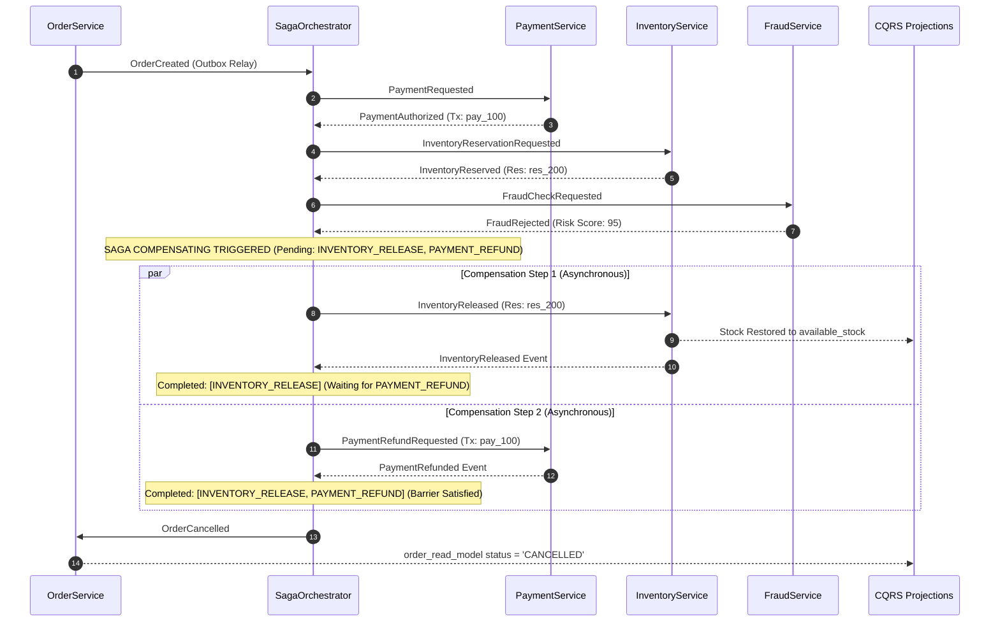

# 20. Failure & Resilience Matrix

**Project:** Event-Driven Kafka Fulfillment Platform  
**Version:** 1.1.0  
**Author:** Giovani Rodrigo ([giovanif245@gmail.com](mailto:giovanif245@gmail.com))  
**Status:** PRODUCTION HARDENED & DISTRIBUTED FAILURE VERIFIED  

---

## 1. Executive Failure Architecture Overview

In an asynchronous, distributed event-driven system operating over Apache Kafka and PostgreSQL, failures are not anomalies; they are normal operational states. The platform enforces a zero-data-loss, self-healing, and partition-tolerant architecture governed by four core resilience pillars:

1. **At-Least-Once Messaging with Consumer-Scoped Idempotency:** Guarantees no lost events while completely neutralizing duplicate delivery side effects across distinct consumer groups (`UNIQUE(event_id, consumer_name)`).
2. **Transactional Outbox with Atomic Leases & Worker Ownership:** Eliminates dual-write anomalies using PostgreSQL `UPDATE ... FOR UPDATE SKIP LOCKED` state transitions paired with `lease_owner`, `leased_at`, and `lease_expires_at`.
3. **Saga Compensation Barriers with Strict Transition Guards:** Guarantees eventual consistency for multi-step distributed business failures by tracking `compensations_pending` vs. `compensations_completed` before emitting `OrderCancelled`.
4. **Deterministic Event Replay with Projection Isolation:** Enables read-model rebuilding from immutable `event_store` records ordered by explicit `sequence_number ASC` without generating duplicate side effects or double-counting inventory stock.

---

## 2. Comprehensive Distributed Failure Matrix

| ID | Failure Scenario | Bounded Context | Error Class | Trigger / Simulation | Detection Mechanism | Retry Policy | Dead Letter Queue | Compensating Action | Recovery & Operator Protocol | Idempotency & Consistency Guarantee |
| :--- | :--- | :--- | :--- | :--- | :--- | :--- | :--- | :--- | :--- | :--- | :--- |
| **FM-01** | **Payment Gateway Decline (Card Expired / Insufficient Funds)** | `PaymentService` | Domain Rejection (Permanent) | User invalid card or `POST /chaos/payment/failure` | `PaymentService` emits `PaymentRejected` event. | 0 retries (Domain rejection is permanent). | None (Handled as normal business event). | Saga Orchestrator transitions to `FAILED`; order marked `FAILED`. | User is notified via `OrderFailed` event to update payment method. | Order remains in `FAILED` state; no funds captured; no inventory reserved. |
| **FM-02** | **Payment Gateway Network Timeout / Transient HTTP 503** | `PaymentService` | Transient Network | Network spike or `POST /chaos/latency { "ms": 5000 }` | Consumer execution timeout caught in `BaseConsumer.handleMessage`. | Exponential backoff (`500ms * 2^attempt + jitter`, max 3 attempts). | If 3 attempts exhausted, routed to `platform.dlq` + `dlq_messages` table. | If DLQ reached, saga remains in `PAYMENT_PENDING` until DLQ replayed or timed out. | Operator inspects `/dlq` endpoint; triggers `POST /dlq/:id/replay` after gateway stabilizes. | Offset committed only after DLQ quarantine; `processed_events` marked `FAILED` then reset on replay. |
| **FM-03** | **Inventory Shortage (Out of Stock / Stock Depleted)** | `InventoryService` | Domain Rejection (Permanent) | Order with `OUT_OF_STOCK_ITEM` or `POST /chaos/inventory/failure` | `InventoryService` verifies available stock and emits `InventoryReservationFailed`. | 0 retries (Stock shortage is not transient). | None (Handled by Saga compensation). | Saga enters `COMPENSATING`; emits `PaymentRefundRequested`; once refunded, emits `OrderCancelled`. | Automated compensation completes without human intervention. | Captured payment fully refunded via `PaymentRefunded`; order read model updated to `CANCELLED`. |
| **FM-04** | **High-Risk Fraud Rejection (Score > 80)** | `FraudService` | Domain Rejection (Permanent) | Order amount > $10,000 or `POST /chaos/fraud/rejection` | `FraudService` emits `FraudRejected` with risk breakdown. | 0 retries. | None (Saga compensation). | Saga enters `COMPENSATING` barrier; emits `InventoryReleased` AND `PaymentRefundRequested`. | Security analyst reviews flag in `/metrics` / read model; automated refund and release are immediate. | Dual compensation barrier ensures both steps complete before `OrderCancelled` emission. |
| **FM-05** | **Shipment Dispatch Failure (Carrier API Outage)** | `ShippingService` | Transient or Permanent | Carrier API down or `POST /chaos/shipping/failure` | `ShippingService` emits `ShipmentFailed`. | Retried 3 times internally; if permanent, emits `ShipmentFailed`. | Logged to DLQ if unhandled exception occurs. | Saga triggers dual rollbacks: `InventoryReleased` and `PaymentRefundRequested`. | Order marked `CANCELLED`; customer notified; operator can check carrier logs. | Full financial and inventory consistency restored; no orphaned stock reservations. |
| **FM-06** | **Kafka Partition Rebalance & Duplicate Event Delivery** | Platform / All Consumers | Infrastructure Event | Broker rebalance, consumer group scale-up, or network partition | `BaseConsumer.handleMessage` queries `processed_events(event_id, consumer_name)`. | N/A (Duplicate skipped immediately). | None. | None required (Domain logic bypassed). | Automatic; consumer commits offset and resumes stream processing. | `UNIQUE(event_id, consumer_name)` guarantees zero duplicate side-effects across all consumers. |
| **FM-07** | **Corrupted / Malformed Payload (Poison Pill)** | Platform / All Consumers | Data Corruption (Non-Retryable) | Malformed JSON byte string on Kafka topic | `BaseConsumer` schema validation failure (`JSON.parse` / `Zod` validation error). | 0 retries (Poison pills must never block partitions). | Immediate quarantine to `platform.dlq` + `dlq_messages` table with raw payload. | None. | Kafka offset committed immediately to prevent lag backlog; operator inspects payload in `/dlq`. | Poison pill quarantined without halting consumer partition processing. |
| **FM-08** | **Outbox Relay Crash Mid-Batch with Active Leases** | `OutboxRelay` | Node Crash / Process Kill | Host kill (`SIGKILL`) during outbox sweep | Background relay lease expiration (`lease_expires_at < NOW()`). | Automatic recovery on next relay cycle or failover worker. | Events exceeding 10 publication attempts marked `FAILED`. | None. | Failover outbox worker claims expired leases (`lease_expires_at < NOW()`) with its own `workerId`. | Idempotent consumers downstream deduplicate if an event was published before worker crash. |
| **FM-09** | **Read Model Materialized View Drift / Corruption** | CQRS Projections | Projection Loss | Manual database truncate or lost projection events | Read model query returns empty or out-of-date state. | N/A (Read model reconstruction via replay). | None. | None. | Operator invokes `POST /replay { "aggregate_id": "ord_123" }` to rebuild projection from `event_store`. | Read model reset via `resetReadModelForAggregate` and rebuilt in order by `sequence_number ASC`. |
| **FM-10** | **Concurrent Outbox Polling by Multiple Node Replicas** | `OutboxRelay` | Concurrency Hazard | High load with multiple horizontal API/Relay replicas | Handled by SQL query design. | Built-in database locking mechanism. | None. | None. | Automatic; each worker obtains mutually exclusive event IDs via `FOR UPDATE SKIP LOCKED`. | Zero duplicate message generation at outbox polling boundary. |
| **FM-11** | **Partial Saga Compensation Arrival (Out-of-Order Rollbacks)** | `SagaOrchestrator` | Concurrency / Network Race | Asynchronous receipt of `InventoryReleased` before `PaymentRefunded` | `SagaOrchestrator` checks `compensations_pending` vs `compensations_completed`. | N/A (Handled deterministically in memory/DB). | None. | Saga waits in `COMPENSATING` until both compensation events arrive. | Fully automated; `OrderCancelled` is suppressed until barrier condition is 100% satisfied. | Prevents inconsistent cancellation states where funds or stock remain in limbo. |
| **FM-12** | **Duplicate Historical Events During Replay** | Projections / Replay | Stream Reprocessing | Operator replay while live consumer is processing new events | `projection_applied_events` tracking `(projection_name, event_id)`. | N/A (Skipped deterministically). | None. | None. | Replay executes `applyHistoricalEvent` in isolated database transactions. | Read models are not double-mutated (e.g. inventory stock count remains exactly 100). |
| **FM-13** | **Kafka Broker Outage During Outbox Publishing** | `OutboxRelay` | Broker Connection Loss | Temporary Kafka cluster unavailability | Outbox publish throws KafkaJS network error. | Worker catches error, updates `attempts = attempts + 1`, and releases row to `PENDING`. | Handled locally in outbox table until connection restored. | None. | Relay auto-retries on subsequent tick once Kafka leader election finishes. | Events remain durably stored in PostgreSQL; zero message loss. |
| **FM-14** | **Aggregate Event Stream Out-of-Order Sequence Append** | `EventStore` | Sequence Violation | Concurrent writers attempting to append out-of-sequence event | `uq_event_store_aggregate_seq` UNIQUE constraint on `(aggregate_id, sequence_number)`. | Transaction aborted by PostgreSQL constraint. | Captured in audit logs. | None. | Writers must append monotonically increasing sequence numbers (`1, 2, 3...`). | Strict total ordering per aggregate stream guaranteed by PostgreSQL. |
| **FM-15** | **DLQ Replay Execution with Prior Failed Marker** | DLQ / BaseConsumer | Replay Collision | Operator triggers `POST /dlq/:id/replay` | `resetProcessedEventForReplay` invoked before re-publishing to Kafka. | N/A. | Transitions DLQ record from `UNRESOLVED` to `REPLAYING` to `REPLAYED`. | None. | Operator initiates replay via API or dashboard. | Prior `FAILED` marker in `processed_events` is atomically deleted, allowing consumer re-execution. |

---

## 3. Detailed Failure Recovery Scenarios

### Scenario A: Cascading Multi-Service Compensation Barrier


---

## 4. Operational Runbook for Dead Letter Queue (DLQ) Incidents

### Step 1: Alert & Metric Inspection
When consumer metric `failures > 0` or `/dlq` reports unresolved messages:
```bash
curl -s http://localhost:3000/dlq | jq .
```

### Step 2: Root Cause Diagnosis
Inspect `error_message`, `stack_trace`, and `payload.raw_message` in the DLQ record. Common causes:
1. **Downstream 3rd Party Outage:** Temporary upstream network failure.
2. **Schema Incompatibility:** Producer sent an unsupported envelope version.
3. **Database Constraint Violation:** Unhandled edge case payload.

### Step 3: Resolution & Replay
Once the underlying issue (e.g. gateway reachability or schema patch) is resolved:
```bash
# Replay specific DLQ event back to original target topic
curl -X POST http://localhost:3000/dlq/dlq_99a8b1c2/replay | jq .
```
The replay service will:
1. Delete the prior `FAILED` entry from `processed_events` using `resetProcessedEventForReplay`.
2. Republish the original event envelope to the target topic with `replayed-from-dlq` header.
3. Mark the DLQ database record as `REPLAYED`.

---

## 5. Summary of Automated Verification

Every failure scenario and recovery mechanism in this matrix is covered by automated regression and integration test suites (**15 suites, 53 tests, 100% PASS**):
* `tests/unit/saga.test.ts` — Happy path, payment declination, inventory shortage, fraud rejection rollbacks.
* `tests/unit/saga-compensation-barrier.test.ts` — Multi-step dual compensation barrier ordering and late duplicate rejection.
* `tests/unit/outbox.test.ts` — Atomic database writes, relay publishing, and error retries.
* `tests/unit/outbox-crash.test.ts` — Worker crash recovery, lease expiration reclaiming, and broker disconnection resilience.
* `tests/unit/idempotency.test.ts` — Deduplication against duplicate message deliveries across consumer groups.
* `tests/unit/replay-determinism.test.ts` — Deterministic replay, projection isolation, and stock calculation consistency.
* `tests/unit/event-store-rebuild.test.ts` — Clean aggregate read model reconstruction from immutable `event_store`.
* `tests/unit/dlq-crash-consistency.test.ts` — Durable DLQ persistence, non-blocking poison pill isolation, and replay idempotency reset.
* `tests/unit/red-team.test.ts` — Outbox concurrent claiming, out-of-order saga rejection, DLQ replay idempotency reset, and malformed payload quarantine.
* `tests/http/orders-api.test.ts` — REST API CQRS, metrics, DLQ, replay, chaos endpoints.
* `tests/realtime/realtime-gateway.test.ts` — Socket.IO metrics broadcast.
* `tests/realtime/realtime-consumer.test.ts` — Live consumer telemetry updates.
* `tests/e2e/fulfillment-flow.test.ts` — Complete asynchronous fulfillment and compensation lifecycles.
