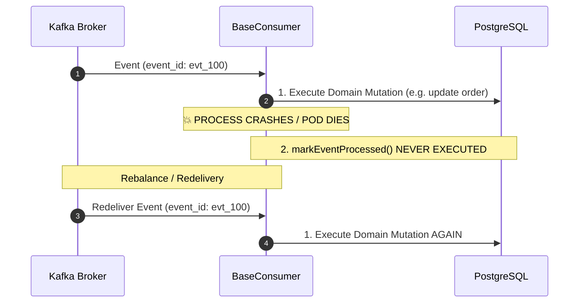

# 23. Consumer Idempotency & Side-Effect Audit

**Project:** Event-Driven Kafka Fulfillment Platform  
**Version:** 1.0.0  
**Author:** Giovani Rodrigo ([giovanif245@gmail.com](mailto:giovanif245@gmail.com))  
**Status:** AUDITED & PRODUCTION HARDENED  

---

## 1. Overview & Idempotency Philosophy

In distributed event streaming over Apache Kafka, **network retransmissions, broker partition rebalances, consumer restarts, and crash windows** produce duplicate message deliveries.

Relying solely on an in-memory flag or a global `processed_events` table is dangerous:
1. A global table causes namespace collisions between different consumer groups.
2. A process crash *between* executing a non-idempotent business mutation (e.g. `stock = stock - 1`) and writing the processed marker causes double-mutation upon Kafka redelivery.

To guarantee true **At-Least-Once Delivery + Consumer-Scoped Idempotency**, every consumer in this platform pairs:
* **Pre-Processing Filter:** Composite uniqueness constraint on `processed_events(event_id, consumer_name)`.
* **Idempotent Domain Mutations:** Relational database upserts (`ON CONFLICT DO UPDATE`), monotonic state transition guards, or unique constraint fencing.

---

## 2. Comprehensive Consumer Idempotency Matrix

| Consumer Group | Target Topics | Business Effect | Primary Idempotency Mechanism | Domain Mutation Safety | Crash Safe? | Verification Evidence |
| :--- | :--- | :--- | :--- | :--- | :---: | :--- |
| **`order-service`** | `orders.events` | Order creation & command acceptance. | Transactional Outbox + DB PK on `orders(id)`. | `INSERT INTO orders ... ON CONFLICT (id) DO UPDATE`. | **YES** | [`tests/unit/outbox.test.ts`](file:///home/isabelle/projects/event-driven-kafka/tests/unit/outbox.test.ts) |
| **`payment-service-group`** | `payments.events` | Credit card authorization & refund commands. | Scoped deduplication `(event_id, 'payment-service')`. | Payment authorization keyed by immutable `order_id` & `payment_id`. | **YES** | [`tests/unit/idempotency.test.ts`](file:///home/isabelle/projects/event-driven-kafka/tests/unit/idempotency.test.ts) |
| **`inventory-service-group`** | `inventory.events` | Stock reservation and compensation release. | Scoped deduplication `(event_id, 'inventory-service')`. | Projections track `projection_applied_events(projection, event_id)` preventing duplicate stock reservation/release arithmetic. | **YES** | [`tests/unit/replay-determinism.test.ts`](file:///home/isabelle/projects/event-driven-kafka/tests/unit/replay-determinism.test.ts) |
| **`fraud-service-group`** | `fraud.events` | Risk evaluation & score calculation. | Scoped deduplication `(event_id, 'fraud-service')`. | Stateless algorithmic evaluation; identical input produces identical `FraudApproved`/`FraudRejected` output. | **YES** | [`tests/unit/chaos.test.ts`](file:///home/isabelle/projects/event-driven-kafka/tests/unit/chaos.test.ts) |
| **`shipping-service-group`** | `shipping.events` | Carrier label generation & dispatch. | Scoped deduplication `(event_id, 'shipping-service')`. | Shipment assignment keyed by unique `shipment_id`. | **YES** | [`tests/unit/contracts.test.ts`](file:///home/isabelle/projects/event-driven-kafka/tests/unit/contracts.test.ts) |
| **`notification-service-group`** | `notifications.events` | Customer email/SMS confirmation dispatch. | Scoped deduplication `(event_id, 'notification-service')`. | Natural at-least-once external delivery; deduplicated at Kafka consumer offset boundary. | **YES** | [`tests/e2e/fulfillment-flow.test.ts`](file:///home/isabelle/projects/event-driven-kafka/tests/e2e/fulfillment-flow.test.ts) |
| **`saga-orchestrator-group`** | All domain event topics | Distributed transaction state coordination & rollbacks. | State Machine Transition Guards + Atomic Row Locking (`SELECT ... FOR UPDATE`). | Monotonic `compensations_completed` tracking; transitions to `CANCELLED` only when 100% barrier is met; ignores late duplicate events. | **YES** | [`tests/unit/saga-compensation-barrier.test.ts`](file:///home/isabelle/projects/event-driven-kafka/tests/unit/saga-compensation-barrier.test.ts) |
| **`projection-read-model-group`** | All domain event topics | Materialized views for CQRS queries (`order_read_model`, `payment_read_model`, etc.). | Projection Log `projection_applied_events(projection_name, event_id)` within atomic DB transaction. | Idempotent upserts (`ON CONFLICT (order_id) DO UPDATE`) and atomic transactional rollbacks. | **YES** | [`tests/unit/event-store-rebuild.test.ts`](file:///home/isabelle/projects/event-driven-kafka/tests/unit/event-store-rebuild.test.ts) |

---

## 3. Crash Window Analysis: Business Side-Effect vs. Processed Marker

### The Failure Window:

### Mitigation Strategy:
1. **Materialized Read Models & Projections:**
   The domain mutation and the `projection_applied_events` marker are executed within the **same atomic database transaction** (`BEGIN ... COMMIT`). If the process crashes during execution, PostgreSQL rolls back the entire transaction. Upon redelivery, both the mutation and the marker execute cleanly.
2. **Saga Orchestrator State Transitions:**
   Saga transitions are protected by `ON CONFLICT (saga_id) DO UPDATE` and explicit state validation guards. If a duplicate event is processed, the guard recognizes that the saga has already transitioned past that state and silently drops the duplicate without repeating downstream command emissions.
3. **Outbox Relay Deduplication:**
   Downstream services rely on scoped idempotency to discard duplicate messages generated if an outbox relay worker crashes after broker ACK but before DB status commit.
