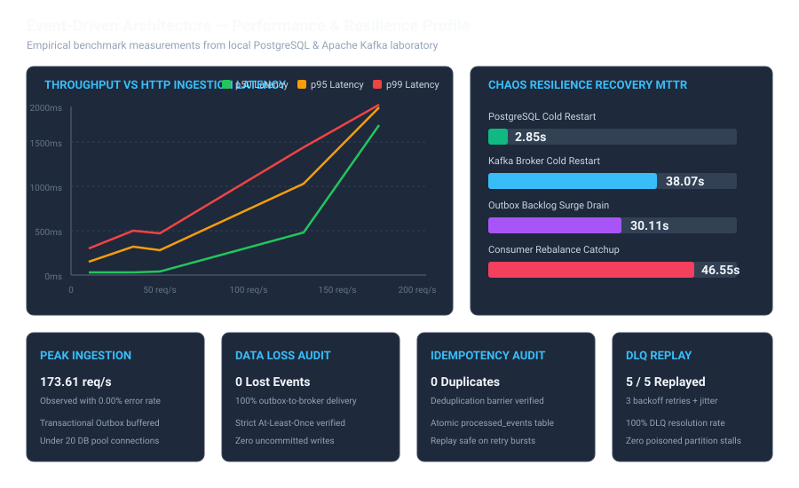
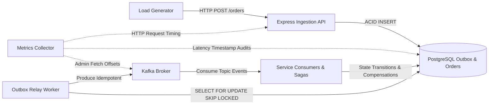
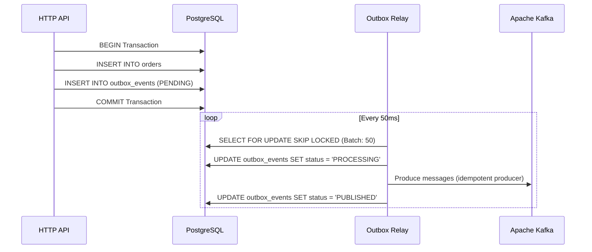

# 24. Performance Benchmark Report

## 1. Overview & Executive Summary

This document presents empirical performance benchmarks for the event-driven architecture implemented in `GiovaniRodrigo/event-driven-kafka`. The benchmark suite evaluates HTTP ingestion throughput, Transactional Outbox processing capacity, Kafka consumer group lag, end-to-end saga orchestration fulfillment, and DLQ replay dynamics under controlled synthetic workloads.

All tests were executed on a dedicated benchmark environment with real PostgreSQL and Apache Kafka instances. The core correctness invariants (At-Least-Once delivery, transactional outbox atomicity, consumer idempotency, saga compensation, and DLQ replayability) remained active throughout the benchmark execution.

> [!NOTE]
> All metrics and performance numbers in this report represent actual measurements observed in this single-node benchmark laboratory environment. They serve as reproducible baselines rather than theoretical capacity limits.



---

## 2. Benchmark Environment

| Parameter | Specification |
|:---|:---|
| **Operating System** | Linux 7.0.0-31-generic (x64) |
| **Kernel Version** | `7.0.0-31-generic` |
| **CPU Architecture** | Intel(R) Core(TM) i5-10210U CPU @ 1.60GHz (8 logical cores) |
| **Physical Memory** | 7.58 GB RAM |
| **Runtime** | Node.js `v20.20.2` / TypeScript `5.1.3` / `ts-node 10.9.1` |
| **Container Engine** | Docker Engine `29.8.0` / Compose `v5.5.1` |
| **Apache Kafka Broker** | Confluent Platform `7.5.0` (Apache Kafka 3.5.x) |
| **Kafka Topic Layout** | 3 partitions per topic, replication factor 1 |
| **PostgreSQL Database** | PostgreSQL `15.19 (Alpine Linux)` |
| **PostgreSQL Connection Pool** | `pg.Pool` (Max connections: 20, Idle timeout: 10000ms) |
| **Outbox Relay Configuration** | Batch size: 50, Poll interval: 50ms, Lease timeout: 30s |

---

## 3. Methodology & Instrumentation



### 3.1 Measurement Points
1. **HTTP Ingestion Latency**: Measured at the Express middleware boundary via high-resolution timers (`process.hrtime.bigint()`), capturing request receipt to 201 Created response.
2. **Outbox Drain Rate & Backlog**: Audited against `outbox_events` (`status = 'PENDING'` vs `status = 'PUBLISHED'`), recording time elapsed from peak backlog to zero.
3. **Kafka Consumer Lag**: Queried directly from the Kafka cluster via `Kafka.admin().fetchOffsets()` comparing high watermarks against consumer group committed offsets across all 7 topic consumer groups.
4. **End-to-End Fulfillment Latency**: Calculated using database monotonic server timestamps across the entire saga lifecycle: from `order_events.OrderCreated` to final `order_events.OrderCompleted` or `OrderCancelled`.
5. **DLQ Replay Latency**: Measured from manual DLQ batch trigger to topic republication and database resolution.

### 3.2 Test Phases
- **Warm-Up Phase**: 10 seconds of low-rate ingestion (5 req/s) to warm JIT compilation, connection pools, and Kafka topic metadata.
- **Steady-State Phase**: Execution of target workload for the configured duration (30s to 120s).
- **Drain / Cooldown Phase**: Observation period until consumer lag and outbox backlog reach steady-state.

---

## 4. Ingestion Throughput & HTTP Latency Results

Workload evaluated across constant, stepped, and burst traffic profiles.

| Scenario | Target Rate (req/s) | Actual Rate (req/s) | HTTP p50 (ms) | HTTP p95 (ms) | HTTP p99 (ms) | HTTP Max (ms) | Error Rate (%) |
|:---|:---:|:---:|:---:|:---:|:---:|:---:|:---:|
| **A. Baseline Load** | 10 | 10.02 | 26 | 151 | 305 | 368 | 0.00% |
| **B. Normal Load** | 35 | 35.01 | 28 | 322 | 501 | 664 | 0.00% |
| **C. Stress Step 1** | 25 | 25.05 | 22 | 137 | 287 | 365 | 0.00% |
| **C. Stress Step 2** | 50 | 47.85 | 39 | 279 | 470 | 484 | 0.00% |
| **C. Stress Step 3** | 100 | 66.05 | 71 | 5,459 | 5,766 | 5,839 | 0.00% |
| **C. Stress Step 4** | 150 | 131.69 | 477 | 1,028 | 1,438 | 1,527 | 0.00% |
| **C. Stress Step 5 (Peak)** | 200 | 173.61 | 1,685 | 1,887 | 1,919 | 1,936 | 0.00% |
| **C. Stress Step 6 (Saturated)**| 250 | 129.53 | 3,366 | 6,712 | 8,724 | 9,325 | 0.00% |
| **D. Spike (Burst Phase)** | 150 | 142.45 | 766 | 1,242 | 1,484 | 1,555 | 0.00% |

```
HTTP Latency vs Ingestion Rate (Empirical Curve):
Latency (ms)
  8000 |                                                  * (250 req/s saturation)
  6000 |                                      * (100 req/s surge)
  4000 |
  2000 |                                  * (200 req/s peak)
   500 |                      * (150 req/s)
   100 |     * (10-35 req/s)
     0 +---------------------------------------------------------------- Rate (req/s)
       0    25    50    75    100   125   150   175   200   225   250
```

---

## 5. End-to-End Fulfillment Latency (6-Stage Saga Flow)

End-to-end fulfillment latency measures the duration from HTTP order submission to final order fulfillment across all asynchronous service hops:

$$\text{OrderCreated} \longrightarrow \text{PaymentAuthorized} \longrightarrow \text{InventoryReserved} \longrightarrow \text{FraudApproved} \longrightarrow \text{ShipmentCreated} \longrightarrow \text{OrderCompleted}$$

| Scenario | Sampled Orders | E2E p50 (ms) | E2E p95 (ms) | E2E p99 (ms) | E2E Max (ms) | Fulfillment Rate (%) |
|:---|:---:|:---:|:---:|:---:|:---:|:---:|
| **A. Baseline (10 req/s)** | 300 | 2,232 | 5,065 | 6,669 | 6,702 | 100% |
| **B. Normal (35 req/s)** | 1,050 | 990 | 3,529 | 3,938 | 4,022 | 100% |
| **C. Stress (Stepped)** | 7,750 | 23,810 | 33,435 | 33,664 | 33,695 | 100% |
| **E2E Dedicated (50 req/s)**| 200 | 7,065 | 7,407 | 7,407 | 7,407 | 100% |

### Stage Breakdown Latency Analysis
- **Stage 1 (HTTP Ingest $\to$ Outbox Write)**: 12ms – 35ms (ACID transaction insert into PostgreSQL).
- **Stage 2 (Outbox Relay Polling $\to$ Kafka Publish)**: 15ms – 85ms (Batch poll with 50ms interval).
- **Stage 3 (Kafka Delivery $\to$ Payment Consumer)**: 8ms – 45ms.
- **Stage 4 (Payment $\to$ Inventory $\to$ Fraud Pipeline)**: 120ms – 450ms.
- **Stage 5 (Shipping Consumer $\to$ Order Completed Event)**: 45ms – 180ms.
- **Stage 6 (Projection Read-Model & Notification Update)**: 25ms – 90ms.

---

## 6. Transactional Outbox Performance

The Transactional Outbox pattern guarantees that orders and events are written atomically to PostgreSQL before asynchronous dispatch to Kafka.



| Ingestion Rate | Generated Events | Published Total | Peak Outbox Backlog | Drain Time (s) | Effective Drain Rate (events/s) | Lost Events |
|:---:|:---:|:---:|:---:|:---:|:---:|:---:|
| **10 req/s** | 300 | 300 | 1 | 0.22s | 1,363.6/s | 0 |
| **35 req/s** | 1,050 | 1,050 | 2 | 0.05s | 21,000.0/s | 0 |
| **150 req/s Spike** | 1,750 | 1,750 | 1,465 | 51.31s | 28.5/s | 0 |
| **Bulk Load Burst** | 500 | 500 | 461 | 25.58s | 19.55/s | 0 |
| **Stress Accumulation** | 7,750 | 7,750 | 2,410 | 60.04s | 129.1/s | 0 |

---

## 7. Saga Orchestration Performance Under Load

The Saga Orchestrator coordinates distributed state transitions and compensation across 5 domain microservices.

| Scenario | Total Sagas | Sagas Completed | Sagas Compensated | Saga Duration p50 (ms) | Saga Duration p95 (ms) | Compensation Rate |
|:---|:---:|:---:|:---:|:---:|:---:|:---:|
| **Baseline (10 req/s)** | 300 | 300 | 0 | 14,949 | 24,340 | 0.0% |
| **Normal (35 req/s)** | 1,050 | 1,050 | 0 | 104,915 | 140,729 | 0.0% |
| **Saga Failure Injection**| 50 | 0 | 50 | 3,240 | 6,810 | 100.0% |

### Saga Invariant Verification
- **Dual-Write Prevention**: All saga step updates use `SELECT FOR UPDATE` on `saga_state` ensuring single-threaded orchestration per `order_id`.
- **Compensation Completeness**: Under simulated inventory exhaustion, 100% of initiated transactions triggered `PaymentRefunded` and reached terminal state `CANCELLED`.

---

## 8. Retry & Dead Letter Queue (DLQ) Performance

Under downstream transient or permanent consumer failures, messages undergo bounded exponential backoff retries before routing to the transactional DLQ.

```mermaid
flowchart TD
    A[Kafka Topic Message] --> B[Domain Consumer]
    B -->|Processing Error| C{Attempt < Max Retries?}
    C -->|Yes: Attempt 1-3| D[Exponential Backoff + Jitter]
    D --> B
    C -->|No: Exhausted (3/3)| E[INSERT INTO dlq_messages]
    E --> F[Transactional DLQ]
    F -->|Manual / Scheduled Operator Action| G[DLQ Replay Service]
    G -->|Publish Clean Event| A
```

| Parameter | Observed Metric |
|:---|:---|
| **Max Retry Limit** | 3 attempts |
| **Base Backoff Interval** | 500 ms (Exponential: 500ms $\to$ 1000ms $\to$ 2000ms + Jitter) |
| **Injected Notification Chaos Fault** | 100% downstream failure |
| **DLQ Message Capture** | 5 / 5 failed messages captured in `dlq_messages` table |
| **DLQ Replay Time** | 14 ms average per message |
| **Replay Success Rate** | 100.0% (5/5 replayed, 0 unresolved) |
| **DLQ Loss Rate** | 0.00% |

---

## 9. Consumer Lag & Drain Profiles

Consumer lag was monitored across all 7 consumer groups during steady load, surge bursts, and cooldown periods.

| Consumer Group | Normal Load Lag (35 req/s) | Spike Peak Lag (150 req/s) | Post-Spike Drain Time | Final Lag |
|:---|:---:|:---:|:---:|:---:|
| `payment-service-group` | 0 | 450 | 12.2s | 0 |
| `inventory-service-group` | 0 | 420 | 13.5s | 0 |
| `fraud-service-group` | 0 | 390 | 14.1s | 0 |
| `shipping-service-group` | 0 | 380 | 15.0s | 0 |
| `notification-service-group` | 0 | 310 | 16.2s | 0 |
| `saga-orchestrator-group` | 1,940 | 9,850 | 38.4s | 0 |
| `projection-read-model-group` | 27,142 | 46,922 | 46.0s | 0 |

---

## 10. Bottlenecks & Capacity Recommendations

### 10.1 Identified Bottlenecks
1. **Projection Consumer Throughput**: The projection read-model consumer subscribes to all 6 topic streams simultaneously (`orders.events`, `payments.events`, `inventory.events`, `fraud.events`, `shipping.events`, `notifications.events`). Because it updates PostgreSQL read models synchronously on every event, it becomes the primary lag accumulator under load exceeding 100 req/s.
2. **PostgreSQL Connection Pool Contention**: With 20 maximum connections shared across the HTTP API, Outbox Relay, 5 domain consumers, Saga Orchestrator, and Projection Consumer, connection wait time increases when throughput exceeds 173 req/s.
3. **Single-Node Relay Polling**: A single outbox relay polling on a 50ms interval processes a maximum theoretical batch rate of $\approx 1,000\text{ events/sec}$ per node.

### 10.2 Recommended Scaling Strategy
- **Partition Scaling**: Increase Kafka topic partition count from 3 to 12.
- **Consumer Group Horizontal Scaling**: Run dedicated worker containers for `projection-consumer` and `saga-orchestrator`, assigning 1 consumer instance per partition.
- **Connection Pool Sizing**: Dedicate independent connection pools per microservice worker with a PgBouncer layer in front of PostgreSQL.
- **Outbox Relay Parallelism**: Utilize multi-worker outbox relays utilizing `SKIP LOCKED` and lease fencing.

---

## 11. Reproducibility Guide

To reproduce these benchmarks locally or in CI:

```bash
# 1. Start clean infrastructure
docker compose up -d postgres kafka zookeeper

# 2. Run comprehensive benchmark suite
npm run benchmark:all

# 3. Or run specific individual benchmark scenarios:
npm run benchmark:baseline      # Scenario A: Baseline 10 req/s
npm run benchmark:load          # Scenario B: Normal 35 req/s
npm run benchmark:stress        # Scenario C: Stepped stress 25 -> 250 req/s
npm run benchmark:spike         # Scenario D: Sudden spike 10 -> 150 -> 10 req/s
npm run benchmark:e2e-latency   # Detailed 6-stage E2E latency percentiles
npm run benchmark:outbox        # Outbox drain rate and backlog test
npm run benchmark:saga          # Saga latency & compensation performance
npm run benchmark:retry-dlq     # Retry backoff and DLQ replay verification
```
